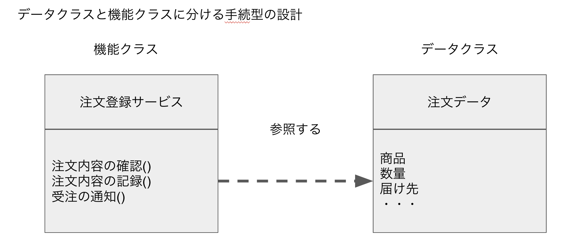
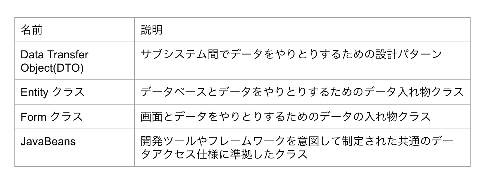
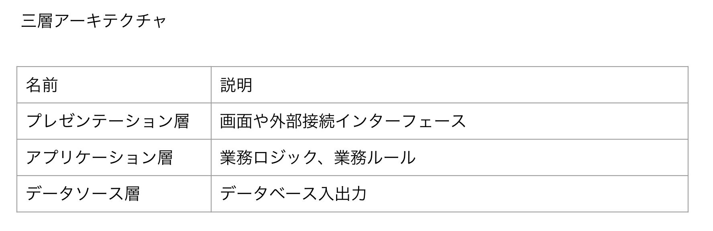
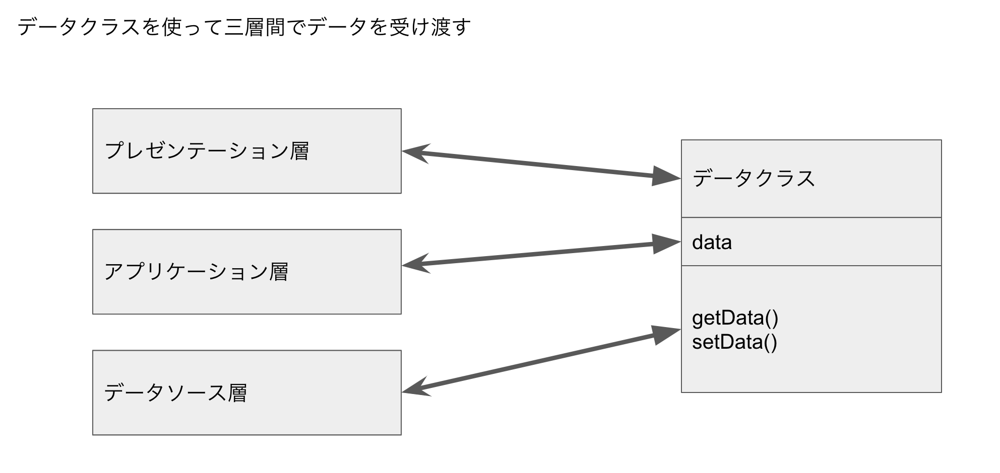

## データとロジックを別のクラスに分けることがわかりにくさを生む

## 業務アプリケーションのコードの見通しが悪くなる原因
従来の手続き型の設計では、

アプリケーションのクラス構成を、

データに格納するデータクラスと、

ロジックを記述する機能クラス（ロジッククラス）

に分けることが基本になります。



データクラスは、表のように様々な名前で呼ばれますが「データを格納するためのクラス」

という点で同じものです。

* データクラスのいろいろな呼び方


データクラスは、getQuantity()/setQuantity()など、いわゆるgetter/setterと呼ばれるメソッド群だけを持ちます。

データを使った判断/加工/計算のロジックは、

機能クラス（ロジッククラス）に記述します。

業務アプリケーションでは、業務ロジックを整理するために、

画面インターフェース/業務ロジック/データベース入出力の3つの関心事を分離するための

三層アーキテクチャが一般的です。

* 三層アーキテクチャ


しかし、三層アーキテクチャを採用しても、

データクラスと機能クラスを分ける手続き型の設計のままでは、

アプリケーションの修正や拡張が必要になった時に以下の状況になりがちです。

* 変更の対象箇所を特定するために、プログラムの広い範囲を調べる
* 一つの変更要求に対して、プログラムのあちこちの修正が必要
* 変更の副作用が起きないことを確認するための大量のテスト

こうなってしまうのは、データクラスと機能クラスを分ける手続き型の設計では、

業務ロジックが入り組んでくると、次の問題が顕著になるからです。

* 同じ業務ロジックがあちこちに重複してかかれる
* どこに業務ロジックが書いてあるか見通しが悪くなる

それぞれの問題について、もう少し具体的に考えてみましょう。

## データクラスを使うと同じロジックがあちこちに重複する
データクラスを使う設計では、ロジックは機能クラスに書きます。

このやり方だと、データクラスを参照できる場所であれば、

どこにでもロジックがかけます。

データクラスを使った業務アプリケーションの構造は次のようになります。



プレゼンテーション層/アプリケーション層/データソース層は、

同じデータクラスを参照できます。

その結果、そのデータクラスのデータを使うロジックは、

どの層のクラスにも書けてしまいます。

また、同じロジックが異なるクラスに重複して記述されがちです。

三層のどこにでもロジックが書け、

しかもあちこちに業務ロジックが重複すると、

変更が大変になります。

変更の対象箇所を特定するために広い範囲のソースコードを調べる必要があります。

必要な箇所を全て修正し、

変更の副作用がないことを確認するために広い範囲をテストしなければいけません。

そもそもデータクラスと機能クラスに分ける設計は、

「クラス」本来の使い方ではありません。

むしろJavaが言語の仕組みとしてクラスを採用した意図とは正反対の使い方です。

Javaは

「クラスに基づいた、オブジェクト指向の汎用のプログラミング言語」

として開発されました。

クラスはデータとロジックを1つのプログラミング単位にまとめる仕組みです。

データをインスタンス変数として持ち、

そのインスタンス変数を使った判断/加工/計算のロジックを

メソッドに書くのが、クラス本来の使い方です。

しかし、データクラスは判断/加工/計算のロジックを持ちません。

データとロジックを一体にするクラス設計の原理から外れています。

* ロジックを持たないデータクラスの例(悪い例)
```
class DataWithoutLogic {
  String value;

  String getValue() {
    return value;
  }

  void setValue(String value) {
    this.value = value;
  }
}
```

このデータクラスは、Javaの文法的には何も間違っていません。

しかし、オブジェクト指向のクラスの使い方としては、間違っています。

このクラスはデータを格納しているだけです。

データを使った判断/加工/計算のロジックを持っていません。

このようなロジックを持たないクラスは、本来のクラスではありません。

ロジックを持たないデータクラスを使ってデータの受け渡しをすると

コードの重複が起きます。

データクラスを参照できる場所であれば、

どのクラスにでも、ロジックが書けてしまうわけです。

## データクラスを使うと業務ロジックの見通しが悪くなる

三層アーキテクチャでは、業務ロジックをアプリケーション層に記述するのが基本です。

しかし、データクラスを使ってしまうと、アプリケーション層に業務ロジックを集めても、

どこに何が書いてあるかの見通しが悪くなりがちです。

その原因には2つのパターンがある。

* アプリケーション層の構造が画面の構造に引きずられる
* アプリケーション層の構造がデータベースの都合に影響される

### 画面の構成に引きずられる
アプリケーション層の機能クラスと画面が密に結合した失敗したパターンです。

例えば、「注文画面」の入力内容を「注文データクラス」に格納し、

アプリケーション層の「注文登録クラス」で処理をする、という設計です。

画面と機能クラスを１対１で関連付けると、複数の機能クラスに同じ業務ロジックが重複しやすくなる。

例えば、注文登録機能と注文変更機能に、同じ金額計算ロジックが重複します。

画面単位に機能クラスを作ってしまうと、業務ルールの変更が必要な時に、

どの機能クラスが変更の対象になるかを特定するかのが大変になります。

また、変更が適切に行われていることを確認するには、広い範囲のテストが必要です。

### データベースの都合に影響される

機能クラスをテーブルのCRUD

(Create：生成、Read：読み取り、Update：更新、Delete：削除)

操作単位に設計してしまう失敗パターンです。

この場合も、どの機能クラスにどのような業務ロジックが書かれているかの見通しが悪くなります。

例えば、注文テーブルのCRUD操作と、出荷テーブルのCRUD操作を、

それぞれ別の機能クラスとして実装する設計です。

この時、注文の合計金額は、注文レコードの登録時に計算しているかもしれません。

もしかすると、合計金額という導出項目を計算する責任は、

プレゼンテーション層のクラスが担当しているかもしれません。

合計金額を計算する導出ロジックは重要な業務ロジックです。

しかし、テーブル単位にアプリケーション層の機能クラスを設計すると、

導出ロジックをどこに置くべきかが明確ではありません。

その結果、合計金額を計算したり、合計の結果を基に判断をするような業務ロジックが、

どこに書かれているか、わかりにくくなってしまうのです。

## 共通機能ライブラリが失敗する理由

データクラスと機能クラスに分ける設計でも、コードの重複を防ぐ工夫はあります。

共通で使いたいロジックを集めて、共通ライブラリクラスとして用意する方法です。

いわゆるUtilクラスとかCommonクラスです。

しかし、この共通ライブラリ方式では、業務ロジックの共通化をそれほど実現できません。

コードの重複が防げないのです。

うまく以下ないパターンは2つあります。

### 汎用的な共通関数

一つは、汎用化のために使いにくくなるパターンです。

共通化できそうなロジックも、ニーズが微妙に異なることがよくあります。

そのため、共通関数を作る時に、汎用的に使えるように、

関数の引数にフラグやオプション引数を増やして対応します。

引数が増えれば増えるほど、そのメソッドを使う側は、

自分には関係のない引数まで理解することが必要となり、

適切な使い方を理解するのが大変になります。

そういう面倒な共通メソッドを調べて使うよりは、

簡単なメソッドを自作した方が楽で確実です。

いろいろな使い方に対応できるように、

引数を増やして汎用化しても、かえって使いにくくなるため、

結局誰も使いません。

その結果、同じようなロジックがあちこちに書かれます。

### 用途ごとに細分化した共通関数

汎用化がダメなら、用途別に細分化した、たくさんの共通関数を用意するやり方はどうでしょう。

実はこの方法もうまく行きません。

用途別に細かく分けると共通ライブラリのメソッド数が膨れ上がります。

その結果、似たようなメソッドの中から、

自分のニーズにぴったりあったメソッドを探したり、

微妙な違いを理解してメソッドを使い分けるのが大変になります。

そうなれば、やはり、簡単なメソッドを自作した方が楽で確実です。

用途別に細分化しても、共通ライブラリのメソッドは使われず、

あちこちに同じロジックが書かれます。

このように、どちらの場合もコードの重複を防ぐことはできません。

共通ライブラリのメソッドは使われず、

似たようなコードがあちこちに散らばります。

その結果、どこに何が書いてあるかわかりにくくなり、

修正の対象箇所が増え、変更が大変になるばかりです。

## 業務ロジックをわかりやすく整理する基本のアプローチ

三層アーキテクチャを採用しても、データクラスと機能クラスを分ける設計では業務ロジックをうまく整理できません。

どうすれば業務ロジックをもっとわかりやすく整理し、

変更を楽で安全にできるでしょうか。

基本的な方針は2つ

* データとロジックを一体にして業務ロジックを整理する
* 三層のそれぞれの関心事と業務ロジックの分離を徹底する

以降では、この2つの方針に基づいた設計のやり方を説明します。

## COLUMN データクラスが広く使われているのはなぜか？

オブジェクト指向言語として登場したJavaを使ったアプリケーションで、

なぜデータクラスのようなオブジェクト指向らしくない設計スタイルが広まってしまったのでしょうか。

それは、Javaが業務アプリケーションに利用されるようになった経緯に関係します。

Javaは1995年に発表され、Webアプリケーションのサーバ側の開発言語として利用が広がりました。

その当時の業務アプリケーション開発は、汎用コンピュータではCOBOLが、Unix系ではC言語やC++が、主な開発言語でした。

業務アプリケーションをWebアプリケーションとして開発するようになると、

業務アプリケーションの開発言語も、

COBOLやC言語からJavaに移行していきます。

その際、設計のやり方や開発の進め方は、

従来の業務アプリケーション開発をそのまま引継ぎました。

COBOLやC言語で行っていた設計を、

そのままJavaにも適用したのです。

COBOLやC言語は手続き型のプログラミング言語です。

手続き型の設計では、プログラムをデータ構造とロジックの記述に分けます。

そして、プログラムの構造は、トップダウンの機能分割が基本です。

そして、プログラムの構造は、トップダウンの機能分割が基本です。

この手続き型の設計スタイルをJavaで踏襲した結果が、

データクラスと機能クラスに分ける設計です。

Javaのプログラムが、必ずクラス単位で書く必要があります。

Javaで手続き型の設計を踏襲すればデータ構造を記述するクラスがデータクラスになり、

処理を記述するクラスが機能クラスになるわけです。

つまり、オブジェクト指向を意図したJavaクラスを、

手続き型プログラミングの実装単位として採用したものです。

データクラスと機能クラスを分けるやり方は、

業務アプリケーションの設計パターンとして推奨さえされました。

J2EEやStrutsなどのWebアプリケーション用のフレームワークでは、

データクラスと機能クラスを分けることを基本にしています。

もともとJavaは、C言語からの移行しやすさを重視して設計されました。

そのため、データを格納するデータクラスと、

ロジックを書く機能クラスに分ける手続き型の設計が、

Javaでも受け入れやすかったという面もあります。

