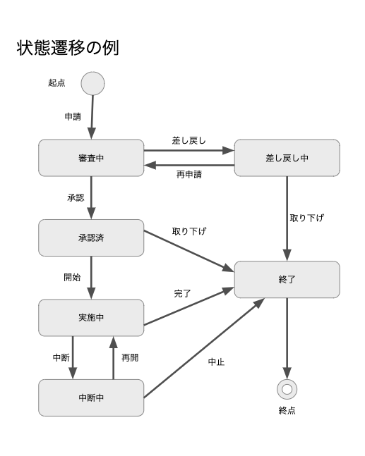
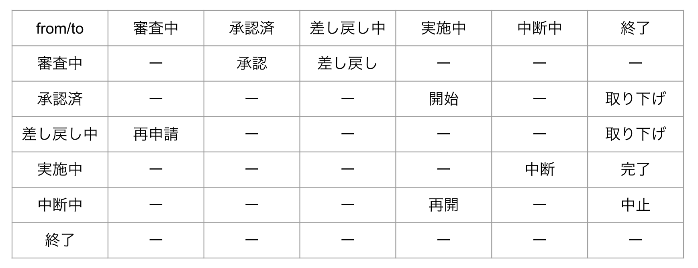

## 状態の遷移ルールをわかりやすく記述する

業務アプリケーションでは、状態の遷移を管理することも重要な関心事の一つです。

例えば申請/承認/実施に伴う6つの状態の遷移を考えてみます



ある状態が遷移できる次の状態には制限があります。

例えば申請中から承認済には遷移できますが、審査中から実施中に遷移することはできません。

列挙型を使うと、このような状態遷移に関わる制約を、if文/switch文を使わずに表現できます。

まず、全ての状態を列挙型で宣言します。

* 状態を列挙する
```
enum State {
  審査中,
  承認済,
  実施中,
  終了,
  差し戻し中,
  中断中
}
```

Javaの列挙型は区分を集合として扱うことができます。

状態の一覧を配列として取得したり、

コレクション型として状態の集合を操作できます。

* 状態の一覧や部分集合の扱い方
```
State[] states = State.values(); // 状態の一覧
Set nextStates = EnumSet.of( 承認済, 差し戻し中 ); // 状態のグルーピング
```

Enumのvalues()メソッドを状態の一覧が取得できます。

また、EnumSetクラスのof()メソッドを使うと、

指定した複数の状態を含むSetクラスのオブジェクトを生成できます。

このEnumSet#of()と、Mapを組み合わせて使うことで、

ある状態から遷移可能な状態を宣言的に記述できます。

まず、可能な状態せんいの組み合わせを確認してみましょう。



この状態遷移表を列挙型とコレクションを使ってコードで表現するやり方は次の通りです。

* ある状態から遷移可能な状態（複数）をSetで宣言する
* 遷移元の状態を「キー」に、遷移可能な状態のSetを値（バリュー）にしたMapを宣言する

コードでみてみましょう。

* ある状態から遷移できるかを判定する
```
class StateTransitions {
  Map<State, Set<State>> allowed;

  {
    allowed = new HashMap<>();

    allowed.put(審査中, EnumSet.of(承認済,差し戻し中));
    allowed.put(差し戻し中, EnumSet.of(審査中, 終了));
    allowed.put(承認済, EnumSet.of(実施中, 終了));
    allowed.put(実施中, EnumSet.of(中断中, 終了));
    allowed.put(中断中, EnumSet.of(実施中, 終了));
  }

  boolean canTransit(State from, State to) {
    Set<State> allowedStates = allowed.get(from);
    return allowedStates.contains(to);
  }
}
```

allowed変数はMap形式です。

ある状態から遷移可能な状態のSetを宣言します。

canTransit()メソッドで、from状態からto状態への遷移可能かどうか判定しています。

判定にif文/switch文は不要です。

こうすることで、状態の種類が増えたり、状態遷移の制約のルールを変更しても、

副作用の心配がなくなります。

このやり方はいろいろ応用が効きます。図２−２の矢印は、ある状態から別の状態に遷移する「イベント」を表しています。

状態の列挙型と、イベントの列挙型を組み合わせることで、次のようなルールを宣言的に記述できる。

* あるイベントがその状態で起きて良いイベントか起きてはいけないイベントかの判定
* ある状態で発生しても良いイベントの一覧の提示

Javaの列挙型は振る舞いを持てます。

状態やイベントごとの判断/加工/計算のロジックを、

それぞれの状態区分やイベント区分に持たせることができます。

静的なルールだけではなく、状態に関わる動的なビジネスルールも、

列挙型を活用することで、見通し良く整理でき、

変更も楽に安全にできる。

このような状態遷移に関わる業務ロジックを分析して整理することは、

業務アプリケーションの中心課題の一つです。

そして、オブジェクト指向の開発では、

状態線いずのような視覚的な表現を使った分析活動と、列挙型という実装の仕組みを

直接的に関連づけて、分析と設計を進めます。

業務の理解とコードの実装が一致しているほど、

プログラムはわかりやすくなり、

業務要件の変更や機能の追加への対応が楽で安全になります。

## まとめ
* 区分ごとのロジックはプログラムを複雑にする厄介な存在
* 早期リターンやガード節を使うと区分ごとのロジックをわかりやすく整理できる
* 区分ごとに別のクラスに分けると独立性を高めることができる
* 多態を使うと、区分ごとのロジックをif文/switch文を使わずに記述できる
* Javaの列挙型(enum)は多態をシンプルに記述する仕組み
* 列挙型を活用すると、区分ごとの業務ロジックをわかりやすく整理して記述できる