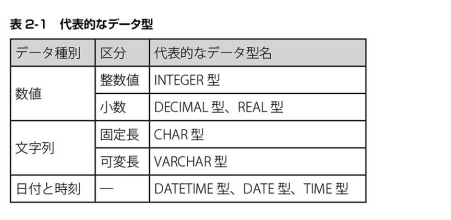
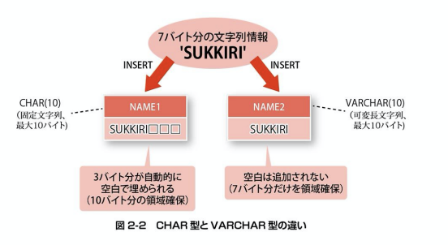
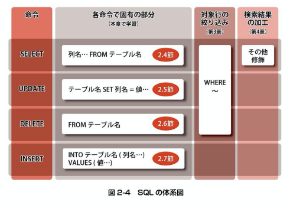
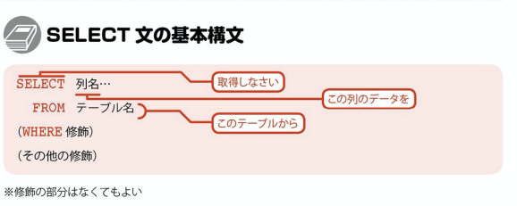

## SQLに共通する基本ルール
* 文の途中に改行を入れることができる
* 行の先頭や行の途中に半角の空白を入れることができる

## SQLに共通する基本ルール2
* コメントの書き方
-- ハイフン二つでコメントアウト
/*
  このタイプだと範囲内はコメントアウト
*/

## SQLに共通する基本ルール3
* SELECTやWHEREなどの命令に使う言語は、SQLとして特別な意味を持つ「予約語」である
* 予約語を記述する際は、大文字と小文字の区別はない。
* テーブル名や列名に予約語を利用することはできない。

## データ型とリテラル
SQL文の中に書き込まれたデータそのものを特に「リテラル」といいます。

## リテラルの記述に関するルール
* 「'」でくくらずに記述されたリテラルは、数値情報として扱われる
* 「'」でくくられたリテラルは、基本的に文字列情報として扱われる
* 「'」でくくられ、'2018-02-25'のような一定の形式で記述されたリテラルは、日付情報として扱われる。

## データ型
* テーブルの各列には、データ型が指定されている
* 列には、データ型で指定された種類の情報しか格納することはできない
* 利用可能なデータ型は、DBMS製品によって異なる

## CHARとVARCHARの違い

## SQLの命令体系
DML(Data Manipulation Language)と総称される。

### SQLの言語体系
* SQLでデータ処理を行うには、命令をたくさん覚える必要はない。
* 4大命令だけで、ほとんどの処理を実現できる

### 4大命令をスッキリ学ぶコツ

## SELECT文 データの検索

### 別名をつけるメリット
* 結果表における列のタイトルを任意のものに変更できる
* わかりにくい列名や長い列名でも、わかりやすく短い別名をつけて利用することができる

SELECT *
を濫用はNG

## UPDATE文 データの更新
UPDATE文は、すでにテーブルに存在するデータを書き換えるための命令です。

WHEREで対象行を指定しないと、UPDATE文は全ての行を書き換えてしまう。

## DELETE文 データの削除
DELETE文は、すでにテーブルに存在する行の削除するための命令です。

* WHEREのないDELETE命令は全件削除！！
WHEREで対象行を指定しないDELETE文は、全データを削除する。

## INSERT文 データの追加
INSERT文は、テーブルに新しいデータを追加するための命令

## 4つのSQLをスッキリ学ぶコツ
1. 4大命令の構造と修飾語の全体像をしっかり把握する
2. 4大命令の2通りの分類方法を理解する
3. 4大命令に共通するテーブル指定を先に書く

## 4大命令の分類方法 検索系と更新系
検索系: SELECT
更新系: UPDATE, DELETE, INSERT

## 4大命令の分類方法 既存系と新規系
既存系: SELECT, UPDATE, DELETE
新規系: INSERT

## 4大命令の全てに共通すること

## まとめ
SQLの基本ルール
* 記述の途中で改行しても良い。
* 予約語は大文字、小文字が区別されない。また、列名などに利用できない
* 文中にコメントを記述することができる

データ型とリテラル
* SQL文の中に直接記述されるデータのことをリテラルという
* 数値、文字列、日付など、データの種類に応じてリテラルの記述方法は異なる
* テーブルの各列にはデータ型が指定されている
* 列に指定された種類のデータのみ、その列に格納することができる

SQLの体系
* SELECT、UPDATE、DELETE、INSERTの4つの命令を利用する
* 各命令をどのように実行するかを指示する修飾が豊富に用意されており、組み合わせることによって多様な命令が実現できる
* 4つの命令は、操作内容から見た検索系と更新系、対象とするデータから見た既存系と新規系に分類することができる。

4大命令をスッキリ学ぶコツ
* 4大命令の構造と修飾語の全体像をしっかり把握する
* 4大命令の2通りの分類方法を理解する
* 4大命令に共通するテーブル指定を先に書く

SELECT
UPDATE
DELETE
INSERT
FROM
FROM
INTO
WHERE

INTEGER
VARCHAR
DATE
DECIMAL
TIME
INTEGER
CHAR

SELECT コード, 地域, 都道府県名, 県庁所在地, 面積
FROM 都道府県
SELECT * FROM 都道府県
SELECT 地域 AS area, 都道府県名 AS pref FROM 都道府県

INSERT INTO 都道府県(コード, 地域, 都道府県名, 面積)
VALUES ('26', '近畿', '京都', 4613)

INSERT INTO 都道府県
VALUES ('37', '四国', '香川', '高松', 1876)

INSERT INTO 都道府県(コード, 都道府県名, 県庁所在地, 面積)
VALUES ('40', '福岡', '福岡')

UPDATE 都道府県 SET 県庁所在地 = '京都'
WHERE コード = '26'

UPDATE 都道府県
SET 地域 = '九州', 面積 = 4976
WHERE コード = '40'

DELETE FROM 都道府県 WHERE コード = '26'