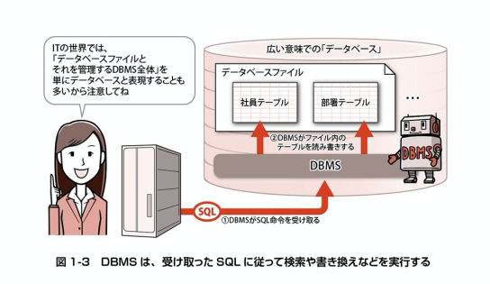

## データベースとは

複数の表の形式でデータを管理する
リレーショナルデータベース(RDB)

* RDBには複数の表が入っており、個々の表をテーブル(table)という。
* 個々のテーブルには名前が付いており、その名前をテーブル名という。
* テーブルは列(column)と行(row)で構成される。
* 1つの行が1件のデータに対応し、列はそのデータの要素に対応する

列はカラムやフィールドと呼ぶ

## データベース管理システム(DBMS)

SQLを送る相手はデータベースファイルではなく、データベース管理システム(DBMS:Database Management System)と呼ばれるプログラム

## RDBMS

DBMSの内、複数の表の形式でデータを取り扱うものをRDBMS(Relational Database Management System)といいます。

## DBMS製品のインストール手順(OSSのみ)
MySQL
https://devnote.jp/MySQL

MariaDB
https://devnote.jp/MariaDB

PostgreSQL
https://devnote.jp/PostgreSQL

SQLite
https://devnote.jp/SQLite

H2 Database
https://devnote.jp/H2

## 命令の動作
SELECT文: ある条件を満たす行を探す => その行の内容を取得する
UPDATE文: ある条件を満たす行を探す => その行の内容を書き換える
DELETE文: ある条件を満たす行を探す => その行を削除する

## まとめ
データベースの概要
・データベースとは、管理や分析を目的としてさまざまなデータを蓄積したものを指す。
・ITにおけるデータベースの実体は、通常、ファイルである
・データベースはデータベース管理システム(DBMS)によって管理される。
・現在、さまざまなDBMSがソフトウェア製品として公開されている。
・複数のテーブルの形式でデータを管理するものをリレーショナルデータベースという
・テーブルには名前が付いており、行と列から構成されている

SQLの概要
・SQLは、データベースやデータを操作するための専用言語である。
・SQLで書かれた命令(SQL文)をDBMSに送信することで、データの検索・追加・更新・削除などを行うことができる
・SQLを送信するには、ドライバを用いたプログラムを新しく開発するか、既存の送信プログラムを利用する
・SQLの文法は利用するDBMS製品によって少しずつ異なるが、基本的な部分は同じである。

## 練習問題
### 1-1
データベースとは、データ分析や管理を目的としてさまざまな情報を収集・蓄積したものですが、
その実体は「ファイル」です。

これは、「データベース管理システム(DBMS)」と呼ばれるプログラムによって管理され、

私たちはこれにSQLを送信してデータを操作することができます。

また、表形式でデータを管理するデータベースを特に「リレーショナルデータベース(RDS)」

といい、表はデータの要素となる「列」と、1つのデータに対応する「行」から成り立ちます。

### 1-2
Amazonでの購入、閲覧履歴

### 1-3
1. 入金額が50,000円に等しい行を検索して全ての列を表示する
select *
from 家計簿
where 入金額 = 50,000

2. 出金額が4,000円を超える行を全て削除する
delete
from 家計簿
where 出金額 > 4000

3. 2018年2月3日のメモを「カフェラテを購入」に変更する
update 家計簿
set メモ = カフェラテを購入
where 日付 = '2018-02-03'