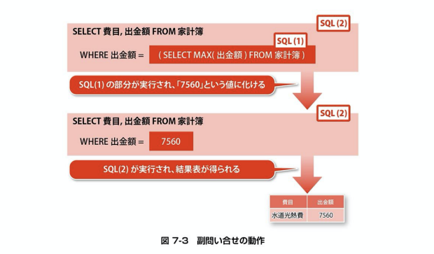

## 副問い合わせ

SQLには、SQL文の内部に別のSELECT文を記述する、

副問い合わせという機能が携わっています。

この機能を使う事で、1つのSQL文で2つ以上の処理をさせる事ができ、

痒いところに手が届くSQL文を作成する事ができます

また、副問い合わせの構造を理解することは、

SQLの作りそのものを理解することにも繋がります。

さぁ、SQLによる可能性をさらに広げていきましょう。

## 検索結果に基づいて表を操作する

```
SELECT MAX(出金額) FROM 家計簿

SELECT 費目, 出金額 FROM 家計簿
WHERE 出金額 = [書き留めた額]
```

これが

```
SELECT 費目, 出金額 FROM 家計簿
WHERE 出金額 = (SELECT MAX(出金額) FROM 家計簿)
```

あるものがその内側に別のものを内包している状態をネスト構造や入れ子と呼びますが、

リスト7-2もSQL文がネスト構造になっている

副問い合わせ、副照会、サブクエリともいいます。

* 副問い合わせとは
```
他のSQL文の一部分として登場するSELECT文。丸括弧で括って記述する
```

* 副問い合わせを習得するコツ
```
・副問い合わせが処理される仕組みを理解しておく
・副問い合わせの代表的な３パターンを学んでおく
```

### コツその１：副問い合わせが処理される仕組み


* 副問い合わせの動作
```
まず、内側にあるSELECT文が実行され結果に化ける
そして、外側のSQLが実行される
```

### 副問い合わせの3つのパターン
* 単一の値の代わりとして、副問い合わせの検索結果を用いる
* 複数の値のかわりとして、副問い合わせの検索結果を用いる
* 表の値の代わりとして、副問い合わせの検索結果を用いる

## 単一の値の代わりに副問い合わせを用いる

### 単一行副問い合わせ
* 検索結果が１行１列の1つの値となる副問い合わせを指す。
* SELECT文の選択列rリストやFROM句、UPDATEのSET句、また1つの値との判定を行うWHERE句の条件式などに記述する事ができる

SET句で副問い合わせを利用する
```
UPDATE 家計簿集計
SET 平均 = (SELECT AVG(出金額)
FROM 家計簿アーカイブ
WHERE 出金額 > 0
AND 費目 = '食費'
)
WHERE 費目 = '食費'
```

方法としては「集計」と「更新」が一度にできます。

### 選択列リストで利用する
```
SELECT 日付, メモ, 出金額
(SELECT 合計 FROM 家計簿集計
WHERE 費目 = '食費') AS 過去の合計額
FROM 家計簿アーカイブ
WHERE 費目 = '食費'
```
過去のデータと比較したい時に別のテーブルから引っ張ってくる事ができる

## 複数の値の代わりに副問い合わせを用いる

### 複数行副問い合わせ
* 検索結果がn行1列の複数の値となる副問い合わせ（ただしnは1以上）
* 複数の値との判定を行うWHERE句の条件式や、SELECT文のFROM句に記述する事ができる

### IN演算子で利用する
```
SELECT * FROM 家計簿集計
WHERE 費目 IN ('食費', '水道光熱費', '教養娯楽費', '給料')
```

### INで副問い合わせを利用する
```
SELECT * FROM 家計簿集計
WHERE 費目 IN (SELECT DISTINCT 費目 FROM 家計簿)
```
DISTINCT: 重複するものを削除する

### ANY/ALL演算子で利用する
```
SELECT * FROM 家計簿
WHERE 費目 = '食費'
AND 出金額 < ANY (SELECT 出金額 FROM 家計簿アーカイブ
WHERE 費目 = '食費')
```

## 練習問題
1行1列の値が返ってくる副問い合わせを単一行副問い合わせという。
SELECT文の選択列リストや、UPDATE文のSET句などで利用できる

n行1列の形で結果を取得できる副問い合わせを複数行問い合わせという。
比較演算子と組み合わせる事で、このような複数の値との比較ができる
ANY演算子やALL演算子を使ったWHERE句の条件に用いる事が多い

SELECT文のFROM句に記述したこの副問い合わせは、別のテーブルを検索した結果である表形式
の情報を、あたかもテーブルのように指定するものである。またINSERT文に記述して、検索結果をそのままの形でテーブルに登録する事ができる
