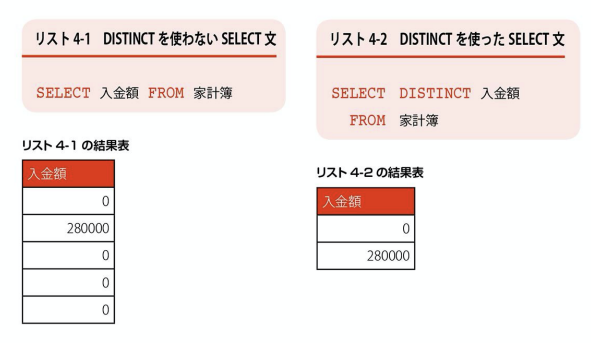

## 検索結果の加工

### SELECT文だけに可能な修飾


### DISTINCT - 重複行を除外する

DISTINCTキーワードをSELECT文に付加すると、結果表の中で内容が重複している行があれば、その重複を取り除いてくれます。

```
SELECT DISTINCT 列名...
FROM テーブル名
```


### DISTINCTはどういう時に使うのか？

どのような種類の支出があったのかを、一覧で抽出することができる。

### ORDER BY - 結果を並べ替える

SELECT文の最後にORDER BY句を記述すると、

指定した列の値を基準として、

検索結果を並べ替えて取得することができます。

```
SELECT 列名 ... FROM テーブル名
ORDER BY 列名 並び純

* 並び順は、ASCまたはDESC（省略するとASCと同じ意味になる）
```

複数の列を基準にした並び替え

```
SELECT * FROM 家計簿
ORDER BY 入金額 DESC, 出金額 DESC
```

列番号を指定した並びかえも可能

```
SELECT * FROM 家計簿
ORDER BY 4 DESC, 5 DESC
```

### OFFSET - FETCH 先頭から数行だけ取得する

検索結果の全行ではなく、並べ替えた結果の１部の行だけを得られれば良いケースもある。

そのような場合、ORDER BY句に続けてOFFSET-FETCH句を付けることによって簡単に実現できる

```
先頭から数件だけを取得する
SELECT 列名... FROM テーブル名
ORDER BY 列名
OFFSET 先頭から除外する行すう ROWS
(FETCH NEXT 取得行数 ROWS ONLY)
* MySQL、MariaDB、SQLiteではサポートされない。
```

### 集合演算子
UNION - 和集合を求める

UNION演算子は、最も代表的な集合演算子です。
2つのSELECT文をUNIONで繋いで記述すると、それぞれの検索結果を足し合わせた結果（和集合）が返されます。

```
2つのSELECT文の結果を足し合わせる
SELECT 文１
UNION (ALL)
SELECT 文２
```

UNION
EXCEPT
INTERSECT
この3つは各テーブルをガッチャンこできる


