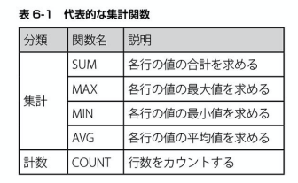
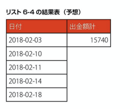
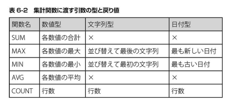
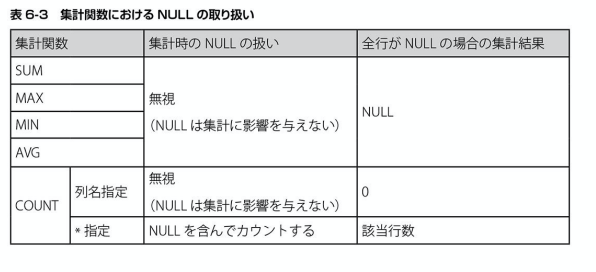
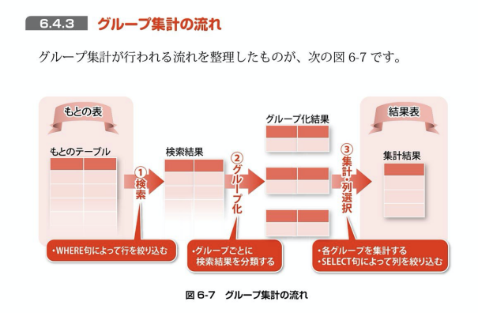
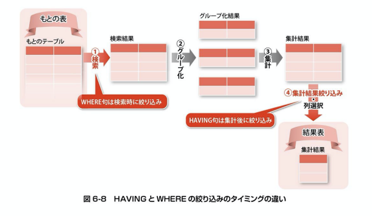
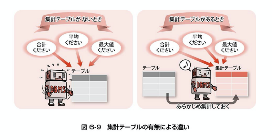
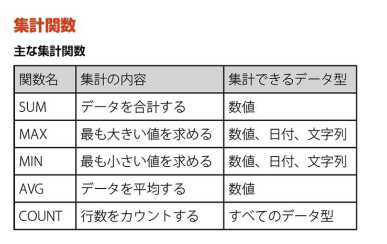

## データを集計する

出金額を集計する
```
SELECT SUM (出金額) AS 出金額の合計
FROM 家計簿
```

集計関数は結果表が必ず１行になる。

集計関数の特徴
* 検索対象の全行をひとまとめに扱い、１回だけ集計処理を行う
* 集計関数の結果は、必ず１行になる

## 集計関数の使い方



SUM = 合計
MAX = 最大
MIN = 最小
AVG = 平均

さまざまな集計を行う

```
SELECT
SUM (出金額) AS 合計出金額,
AVG (出金額) AS 平均出金額,
MAX (出金額) AS 最も大きな散財,
MIN (出金額) AS 最も少額の支払い
FROM 家計簿
```

食費の行数を数える(COUNT)
```
SELECT COUNT(*) AS 食費の行数
FROM 家計簿
WHERE 費目 = '食費'
```

COUNT(*)とCOUNT(列)の違い
* COUNT(*)は、単純に行数をカウントする(NULLの行も含める)
* COUNT(列)は、指定列の値がNULLである行を無視してカウントする

## 集計に関する4つの注意点

1. SELECT文でしか利用できない
集計関数は、SELECT文の選択列リストかORDER BY句、HAVING句にのみ記述できる

2. 結果表がデコボコになってはならない

こういった感じで長方形にならない検索結果はエラーが返される

3. 引数に許される型が異なる


4. NULLの取り扱い


## データをグループに分ける

### グループ化
費目でグループ化してそれぞれの合計を求める

```
SELECT 費目, SUM(出金額) AS 費目別の出金額合計
FROM 家計簿
GROUP BY 費目
```

グループ化して集計する基本構文
```
SELECT グループ化の基準列名..., 集計関数
FROM テーブル名
(WHERE 絞り込み条件)
GROUP BY グループ化の基準列名...
```

集計関数ではWHERE句には利用できない
```
WHERE句を処理する段階では、まだ集計が終わっていないため、集計関数は
WHERE句に利用できない
```



グループ化してから絞り込む基本構文
```
SELECT グループ化の基準列名..., 集計関数
FROM テーブル名
WHERE 元の表に対する絞り込み条件
GROUP BY グループ化の基準列名...
HAVING 集計結果に対する絞り込み条件
```



HAVINGの使い方
```
SELECT 費目, SUM(出金額) AS 費目別の出金額の合計
FROM 家計簿
GROUP BY 費目
HAVING SUM(出金額) > 0
```

## 集計テーブルの活用

非常に大量のデータを取り扱う場合、集計テーブルと呼ばれるテーブルを用いて、
次のような工夫がされます。

* 集計テーブルの利用
```
・あるテーブルの集計結果を格納するための別テーブル（集計テーブル）を作成する
・集計関数を用いて集計処理を１回行い、結果を集計テーブルにINSERTする
・集計結果が必要な場合は、すでに作った集計テーブルに格納されている計算済みの集計結果を利用する
```



* 集計テーブルを用いるリスク
```
集計テーブルに格納されている結果は、最新の集計より古くなってしまう可能性がある
```

* 集計テーブルに不可欠な更新作業
```
集計テーブルの内容が古くならないように、定期的に再集計を行って内容を更新する作業が不可欠である。
```

## まとめ
### 集計
* SQLでは、集計関数を用いてデータを集計する事ができる
* 集計関数は、まとめたグループごとに1つの結果を算出する。
* 集計関数はSELECT文でのみ使用できる

### グループ化
* GROUP BY句にグループ分けの基準となる列を指定する事で、グループ別に集計を行う事ができる
* GROUP BY句を用いない集計では、検索結果の全件を1つのグループとして扱う
* 集計値を元にして特定のグループのみを抽出するには、HAVING句を用いる。



ex) 今月の収入と支出の合計額を知りたい
`SELECT SUM(入金額), SUM(出金額) FROM 家計簿`

ex) 今月の食費を支払った回数を知りたい
`SELECT COUNT(費目) AS 食費を支払った回数 FROM 家計簿 WHERE 費目 = '食費'`

ex) 先月までの水道光熱費で、最も高かった額と低かった額を知りたい
```
SELECT MAX(出金額) AS 最高額, MIN(出金額) AS 最低額
FROM 家計簿アーカイブ
WHERE 費目 = '水道光熱費'
```

ex) 先月までの給料の平均額を知りたい
```
SELECT AVG(入金額) AS 平均額 FROM 家計簿アーカイブ
WHERE 費目 = '給料'
```

ex) 先月までの費目ごとの出費額を知りたい
```
SELECT 費目, SUM(出金額) AS 出金額
FROM 家計簿アーカイブ
GROUP BY 費目
```

ex) 今月の出費のうち、平均が5,000円以上の費目とその最大額を知りたい
```
SELECT 費目, MAX(出金額) AS 最大出金額 FROM 家計簿
WHERE 出金額 > 0
GROUP BY 費目
HAVING AVG(出金額) >= 5000
```

## SELECT文の全貌
```
SELECT 選択列リスト
FROM テーブル名
[WHERE 条件式]
[GROUP BY グループ化列名]
[HAVING 集計結果に対する条件式]
[ORDER BY 並び替え列名]
```
