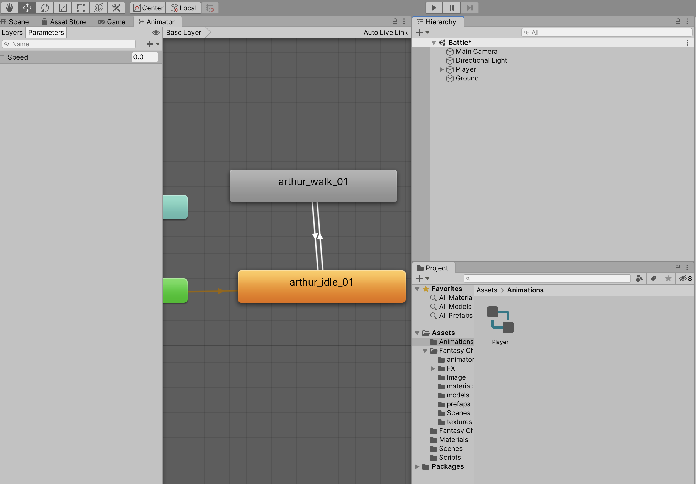

## アニメーションの設定

走っているモーションを付与する

Animationからいろいろ取得する

まずは
IdleとRunを設定する



Has Exit Time


アニメーションはループ処理をONにしないとアニメーションが止まってしまう。


### 方向転換

```
private void FixedUpdate()
    {
        Vector3 direction = transform.position + new Vector3(x, 0, z) * moveSpeed;
        transform.LookAt(direction);
        // 速度設定
        rb.velocity = new Vector3(x, 0, z) * moveSpeed;
        animator.SetFloat("Speed", rb.velocity.magnitude);
    }
```

### 攻撃実装

スペースキーを押すと攻撃実装

```
// 攻撃実装
        if (Input.GetKeyDown(KeyCode.Space))
        {
            Debug.Log("攻撃");
        }
```

攻撃しているときにアニメーションBehaviourを使用していろいろする


アニメーションでcsファイルを作成する

```
// アニメーション開始時
    override public void OnStateEnter(Animator animator, AnimatorStateInfo stateInfo, int layerIndex)
    {
        // 速度を0にしたい
        animator.GetComponent<PlayerManager>().moveSpeed = 0;
    }

    // アニメーション中に実行されるもの
    override public void OnStateUpdate(Animator animator, AnimatorStateInfo stateInfo, int layerIndex)
    {

    }

    // アニメーション終了時に実行される
    override public void OnStateExit(Animator animator, AnimatorStateInfo stateInfo, int layerIndex)
    {
        // 速度を元に戻したい
        animator.GetComponent<PlayerManager>().moveSpeed = 3;
    }
```
