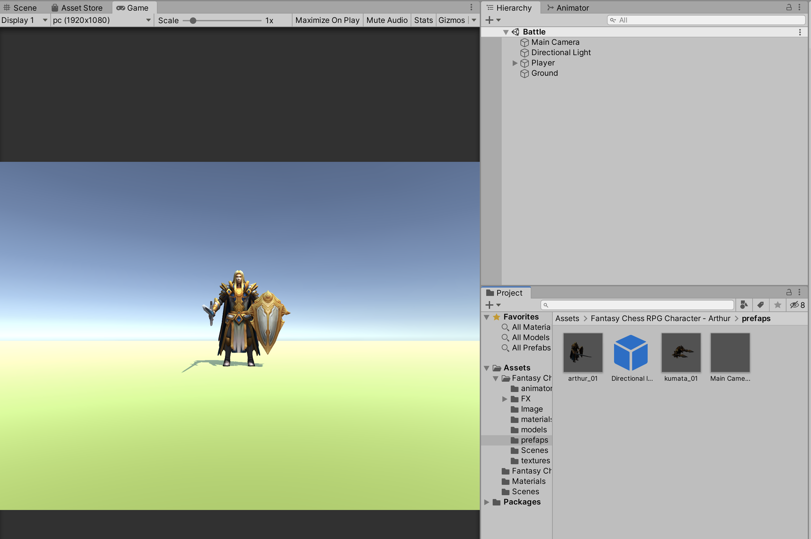
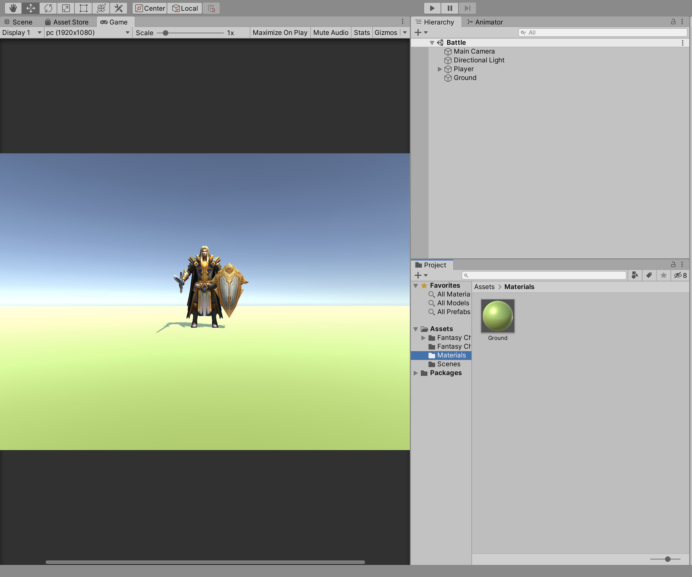

### アセットストアからインポートする

アセットストアからインポートして
インポートしたファイルから
プレハブを使用して入れていく、

ただインポートしたプレハブをそのまま変更してしまうとプレハブの内容も変わってしまうので
必ず

```アンパックプレハブコンプリート```

を行う
イメージ図



あとは床の生成として
3D→Planeを作成
Groundに名前を変更
サイズをx=10 z=10
とすることにより画面サイズを作成

アセットの方でマテリアルを作成
Assetディレクトリの配下の階層でMaterialsのディレクトリを作成して

Materialを作成
Groundに名前を変更
色を変更
PlaneのオブジェクトにMaterialを配置



