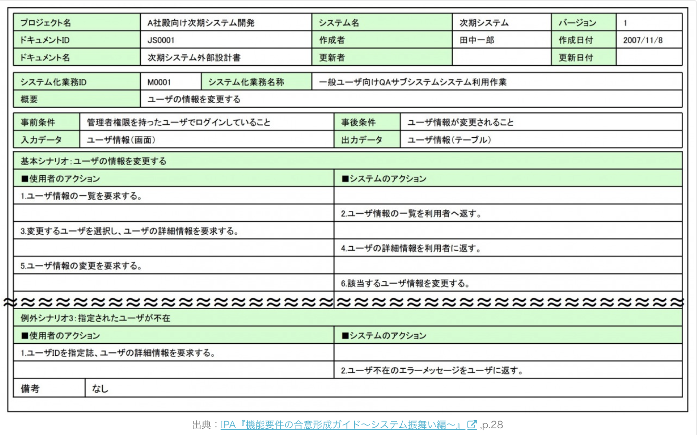
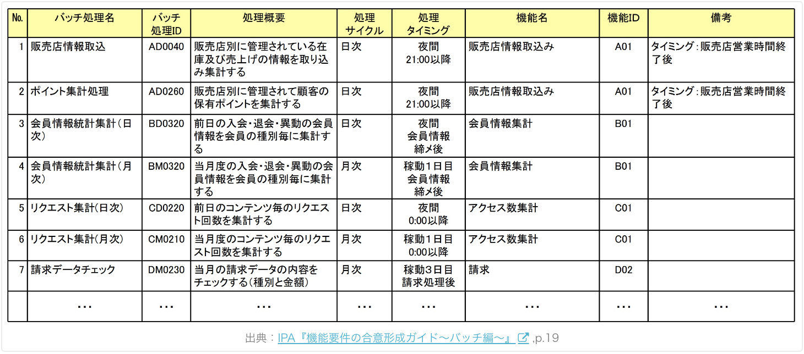

## インフラ設計書の書き方

基本設計は、顧客の要件を実現するためのシステム構成や機能を具体化する工程

基本設計工程では、画面・帳票・テーブルなどの設計をした後に「基本設計書」としてまとめるが、
どのような資料を作るのか不安に感じるエンジニアも多いと思う

そこで今回は基本設計書の書き方を簡単に説明する

## はじめに
基本設計のことを「外部設計」と呼ぶ場合もあるが、「基本設計」に統一して記載している。

基本設計書には、下記の4つを検討の上成果物としてまとめる。

* 業務設計
* システム方式設計
* アプリケーション機能設計
* 非機能用件設計

要件定義書と同じく、企業によっては記載内容やテンプレートを整備している企業もあるので、まずは自社のルールを確認することをお勧めする

## 基本設計書のサンプル

https://www.ipa.go.jp/sec/softwareengineering/reports/20100331.html

https://www.maff.go.jp/j/kanbo/joho/densi_seihu/d_densan_system/pdf/genko6.pdf

https://warp.da.ndl.go.jp/info:ndljp/pid/9972728/ecom-plat.jp/fbox.php?eid=16496

https://warp.da.ndl.go.jp/info:ndljp/pid/11275462/ecom-plat.jp/fbox.php?eid=16945&s=o

特にIPAの資料は、具体的な書き方や検討のコツも紹介しているので、特に参考になると思う

## 基本設計書の目次（成果物一覧）

それでは、ここからは基本設計書の書き方を説明していく

プロジェクトの特性にもよるが、基本設計書には下記の内容を記載する。

1. 業務設計
    
    1-1.システム化の背景・目的

    1-2.システム化の対象範囲
  
    1-3.システム化業務一覧
  
    1-4.新業務フロー
  
    1-5.システム化業務説明

2. システム方式設計
  
      2-1.ハードウェア構成図

      2-2.ソフトウェア構成図
      
      2-3.ネットワーク構成図
      
      2-4.アプリケーション機能構成図

3. アプリケーション機能設計
  
    3-1.画面設計

        3-1-1.画面一覧
        3-1-2.画面遷移図
        3-1-3.画面レイアウト
        3-1-4.画面入出力項目一覧
        3-1-5.画面アクション定義

  3-2.帳票設計

      3-2-1.帳票一覧
      3-2-2.帳票概要
      3-2-3.帳票レイアウト
      3-2-4.帳票出力項目一覧
      3-2-5.帳票編集定義
  
  3-3.バッチ設計
    
      3-3-1.バッチ処理フロー
      3-3-2.バッチ処理一覧
      3-3-3.バッチ処理定義
  
  3-4.テーブル・ファイル設計
    
      3-4-1.テーブル関連図
      3-4-2.テーブル・ファイル一覧
      3-4-3.テーブル定義
      3-4-4.ファイル定義
      3-4-5.CRUD図
  
  3-5.外部インターフェース設計
    
      3-5-1.外部システム関連図
      3-5-2.外部インターフェース一覧
      3-5-3.外部インターフェース項目定義
      3-5-4.外部インターフェース処理概要

4. 非機能用件設計
  
    4-1.性能設計
  
    4-2.信頼性設計
  
    4-3.拡張性設計
  
    4-4.情報セキュリティ設計
  
    4-5.テスト方針
  
    4-6.移行方針
  
    4-7.運用保守設計

## 業務設計

業務設計は下記5つの成果物を整理する。

```
1-1.システム化の背景・目的
1-2.システム化の対象範囲
1-3.システム化業務一覧
1-4.新業務フロー
1-5.システム化業務説明
```

多くの資料は、要件定義でまとめているはずなので、基本設計に新たに作成資料は少ない。

（要件定義での検討が不足していると、基本設計で苦労することになる）

### システム化の背景・目的
システム化が必要な背景と目的を説明した資料

要件定義書にもまとめられているはずなので、基本設計で新しく記載する必要はないだろう

```
背景：なぜシステム化が必要なのか？
目的：システム化に何を期待するのか？
```

### システム化の対象範囲

プロジェクトのシステム化の対象範囲を記載する。

後述の「業務機能構成表」や「アプリケーション機能構成図」に記載する場合もある。

こちらも要件定義書から転記すれば良い。

### システム化業務一覧


業務機能構成表に対して、システム化対象業務を選定した資料

要件定義書から転記する

上記のサンプルのように、業務機能構成表に「システム化対象」という区分を設ける場合が多い

### 新業務フロー


開発するシステムを適用し、新しい業務の流れを図解した資料。

要件定義書から転記することになるが、アプリケーション機能を具体化していく中で修正が必要になる場合もある

### システム化業務説明



システム化の業務について、詳細な内容を記載した資料。

("ユースケースシナリオ"という呼び方をした方がいいかもしれない)

利用者のアクションに対して、システムがどうアクションをするのかを記載する。

基本的な流れ「基本シナリオ」、基本外の流れ「代替シナリオ」に分けて整理していくと良い。

代替はシステム異常とは違うので注意。

下記のように、基本的な流れではないものの、一般的に起こる可能性のあるシナリオのこと。

```
基本シナリオ：晴れの時シナリオ
代替シナリオ：雨の時のシナリオ
```

## システム方式設計
システム方式設計では、下記の成果物を整理する

```
2-1.ハードウェア構成図
2-2.ソフトウェア構成図
2-3.ネットワーク構成図
2-4.アプリケーション機能構成図
```

性能や信頼性などの非機能用件を元に、システム全体の構成を検討する作業だ。

システム構成は、要件定義段階でほぼ決定しているはずなので、

設計の結果を反映させることが主な作業となる

### ハードウェア構成図


今回のシステムを実現する上でのハードウェア構成を明確にする資料

要件定義のハードウェア要件を元に、基本設計で検討した内容を反映させる。

```
・ネットワーク
  回線、ルータ、スイッチ、負荷分散装置、ファイアウォール等

・ストレージ
  ディスク装置、テープ装置等

・サーバー
  CPU、メモリ、入出力機構等
```

### ソフトウェア構成図


今回のシステムを実現する上でのソフトウェア構成を明確にする資料。

要件定義のソフトウェア要件を元に、基本設計で検討した内容を反映させる

```
OS
  Windows、Mac-OS、Unix、Linux、iOS、Android等
```

```
ミドルウェア
・データベース
  Oracle、DB2、SQL Server、MySQL、PostgreSQL等

・Webサーバ
  Apache、nginx、IIS等

・アプリケーションサーバ
  WAS、Tomcat、WebLogic、JBoss、Interstage等

・データ連携
  WebSphere MQ、HULFT

・統合運用管理
  JP1、Systemwalker、Tivoli、A-AUTO等
```

### ネットワーク構成図


今回のシステムを実現する上でのネットワーク構成を明確にする資料。

要件定義のネットワーク要件を元に、基本設計で検討した内容を反映させる

### アプリケーション機能構成図

開発するシステム機能が階層的に分かる資料。

要件定義書から転記しつつ、基本設計の検討結果を反映させよう。

## アプリケーション機能設計では、下記の成果物を整理する

```
3.アプリケーション機能設計
　3-1.画面設計
　　3-1-1.画面一覧
　　3-1-2.画面遷移図
　　3-1-3.画面レイアウト
　　3-1-4.画面入出力項目一覧
　　3-1-5.画面アクション定義
　3-2.帳票設計
　　3-2-1.帳票一覧
　　3-2-2.帳票概要
　　3-2-3.帳票レイアウト
　　3-2-4.帳票出力項目一覧
　　3-2-5.帳票編集定義
　3-3.バッチ設計
　　3-3-1.バッチ処理フロー
　　3-3-2.バッチ処理一覧
　　3-3-3.バッチ処理定義
　3-4.テーブル・ファイル設計
　　3-4-1.テーブル関連図
　　3-4-2.テーブル・ファイル一覧
　　3-4-3.テーブル定義
　　3-4-4.ファイル定義
　　3-4-5.CRUD図
　3-5.外部インターフェース設計
　　3-5-1.外部システム関連図
　　3-5-2.外部インターフェース一覧
　　3-5-3.外部インターフェース項目定義
　　3-5-4.外部インターフェース処理概要
```

基本設計のメインとなる作業。

要件定義のざっくりとした内容を元に、システムを実装できるレベルまで具体的に記載しよう。

### 画面一覧


プロジェクトで開発する画面を一覧にまとめた資料。

要件定義書から転記しつつ、基本設計の検討結果を反映させよう

### 画面遷移図


画面の流れが分かる資料

要件定義書から転記しつつ、基本設計の検討結果を反映させよう。

### 画面レイアウト


画面の具体的なイメージを明確にする資料

要件定義書から転記しつつ、基本設計の検討結果を反映させよう。

### 画面入出力項目一覧


画面の入出力項目が具体的に分かる資料

出力項目は、どのテーブルの、どの項目から値をセットするかまで記載が必要だ。

なお、入力項目でも、プルダウン（コンボボックス）のような選択項目の場合は、どこから値をセットするのか検討が必要である

### 画面アクション定義


画面上の動作が具体的に分かる資料。

基本設計では、ユーザがどのようなアクションをしたときに、システムがどのようなアクションを返すのかを具体的に記載する必要がある。

例えば、上記サンプルでは、ログインボタンが押下された時に「UsernameとPasswordの入力チェック」とだけ書いてあるが、

どのようなチェックをするまで具体的に書く必要がある。

ちなみに、入力チェックをクライアント側に実装するのか、

それともサーバー側で実装するかは、次の工程である

「詳細設計（内部設計とも言う）」にて検討する。

### 帳票一覧


プロジェクトで開発する帳票を一覧にまとめた資料。

要件定義書から転記をしつつ、基本設計の検討結果を反映させる

### 帳票概要


帳票の出力場所や使い方を記載した資料。

要件定義書から転記しつつ、基本設計の検討結果を反映させよう。

* 出力タイミング
* 改ページ条件
* データ上の保管期間

など

### 帳票レイアウト


帳票の具体的なイメージを明確にする資料

要件定義書から転記をしつつ、基本設計の検討結果を反映させよう。

### 帳票出力項目一覧


帳票レイアウトを元に、印字する項目が具体的に分かる資料

画面の出力項目と同じく、どのテーブルの、どの項目から値をセットするまで記載が必要。

### 帳票編集定義


帳票に印字するデータの編集方法を記載した資料。

シンプルな帳票は「帳票出力項目一覧」で十分だが、複雑な編集方法を持つ帳票については、

この資料を作成する

### バッチ処理一覧



プロジェクトで開発するバッチ機能を一覧にまとめた資料。

要件定義書から転記しつつ、基本設計の検討結果を反映させよう

### バッチ処理フロー


バッチ処理の流れが分かる資料。

業務部門の利用者に取っては、理解しづらい資料であるものの、画面や帳票との関係が深いため、

基本設計でまとめておくべき資料である。

### バッチ処理定義


バッチ処理の具体的な入出力と処理内容が分かる資料。

この資料も業務部門の利用者に取っては理解しづらい資料であるものの、

基本設計で検討しておく資料。

### テーブル関連図(ER図)


今回開発するシステムで用いるテーブルの関係性が分かる資料。

要件定義では、業務上の主要なテーブルのER図を作成するが、基本設計では、システムを実現する上で必要なテーブルを全て書き出す。

```
・新しく作成するテーブル
・改廃する既存のテーブル
・参照する既存のテーブル
```

要件定義書に記載したテーブルはもちろんのこと、

バッチ処理内で一時的に利用するテーブル（ワークテーブル）等の記載も書き出そう

### テーブル・ファイル一覧


今回開発するシステムで用いるテーブルやファイルの一覧資料

前述のER図に記載したテーブルを一覧にまとめるだけでなく、

機能の入出力で用いるファイル（txtやcsv等）についても記載する。

### テーブル・ファイル定義


各テーブルやファイルの項目名・データ型・長さ等が分かる資料

### CRUD図


各テーブルについて、どの機能で、作成・参照・更新・削除がされるかをまとめた資料。

上記図は、「テーブルと機能のCRUD図」だが、下記図のように

「テーブル項目と機能とのCRUD図」を作成する場合もある。


### 外部システム関連図


関連システムとのデータのやりとりを図解した資料

### 外部インターフェース一覧


関連システムとやりとりするデータを一覧にまとめた資料

### 外部インターフェース項目定義


関連システムとやりとりするデータについて、主要なデータ項目を一覧にまとめた資料

### 外部インターフェース処理概要


外部システムとやりとりするデータについて、その方法を記載した資料。

システム間のデータ連携については、下記の記事が参考になる。

https://www.atmarkit.co.jp/ait/articles/1501/26/news009.html

## 非機能用件設計

非機能用件設計では下記の成果物を整理する

```
4-1.性能設計
4-2.信頼性設計
4-3.拡張性設計
4-4.情報セキュリティ設計
4-5.テスト方針
4-6.移行方針
4-7.運用保守設計
```

非機能要件設計の各資料には方針や考え方を記載し、具体的な設計内容は、

アプリケーション機能や基盤設計の各資料に反映することとなる。

### 性能設計

要件定義の性能要件に対して、対応方針や評価方法を記載する。
```
・基準値
  画面応答性、バッチ実行時間等

・対策
  アプリケーション機能や基盤設計等の資料へ反映

・評価方法
  テスト段階で、性能を評価する方法を記載
```

### 信頼性設計

要件定義の可用性と完全性の要件に対して、対応方針を記載する。

```
・可用性
「使いたい時に使えるか」の指標。一般的には稼働率を記載する。

・完全性
「データの欠損や不整合がないこと」の指標。
機器の破損への対策、ログの取得など、定性的な書き方となることが多い。
```

```
設計の観点
・可用性
  アプリ面：障害発生時の復旧方法等
  基盤面：システム多重化、縮退運用等

・完全性
  アプリ面：データバックアップや更新ログの取得等
  基盤面：ディスクバックアップ、アクセスログ取得等
```

### 拡張性設計

要件定義の拡張性要件に対して、対応方針を記載する。

```
・規模の拡張性
  利用者やデータの増加に伴うシステム拡張の対応策
・機能の拡張
  機能追加の対応策
```

### セキュリティ設計
要件定義のセキュリティ要件に対して、対応方針を記載する

```
・情報（データ）や情報システムへのアクセスを制限するために、利用者IDの管理（パスワードの管理など）を行う。

・重要な情報に対するアクセス権限の設定を行う

・インターネット接続に関わる不正アクセス対策（ファイアウォール機能、パケットフィルタリング、ISPサービス等）を行う。

・無線LANのセキュリティ対策(WPA2の導入等)を行う

・ソフトウェアの選定や購入、情報システムの開発や保守に際して、情報セキュリティを前提とした管理を行う。

```

### テスト方針

要件定義のテスト要件に対して、テスト方針を記載する。

単体テスト・結合テスト・結合テスト・運用テストといった各テスト工程について、プロジェクトの特性に応じて、下記のような観点を記載する。

```
・テストの目的
・テストの概要
・テストの開始条件
・テストの環境
・テストデータの準備方針
・テストの実施タイミング
・役割分担
```

### 移行方針
要件定義の移行要件に対して、移行方針を記載する。

システム機能だけでなく、データ移行や新業務への移行等、プロジェクトの特性に応じて移行方法を記載する。

### 運用保守設計

要件定義では、定常運用・臨時運用・障害時運用における要件を記載したが、

基本設計段階では、各要件を実施するに当たっての運用保守業務設計、及び必要な環境や機能の設計を行う。

下記に具体的な検討内容例を紹介する。

```
・運用保守業務内容
・役割分担と対象範囲
・管理項目
・必要なシステムやドキュメント
・システム監視方法
・データ管理方法（ログなど
・バックアップ方法
・障害対応方法
など
```

運用保守業務に入る本番移行前〜フォロー期間にて詳細な内容を検討し、

運用保守契約を締結することとなる。

## 最後に

基本設計工程の成果物を紹介してきた。

最初に述べたように、作成する成果物やテンプレートや書き方は、

企業の標準としてまとめられている場合もあるので確認して欲しい。

また、過去案件の成果物を流用するのもいいだろう。

以上、参考になれば幸いです。

## 参考資料

要件定義工程の成果物一覧

https://pm-rasinban.com/rd-doc

要件定義工程の進め方

https://pm-rasinban.com/rd-process

【結論】要件定義の目的は「プロジェクトの失敗を減らすこと」

https://pm-rasinban.com/rd-mokuteki

要件定義書の書き方

https://pm-rasinban.com/rd-write

機能要件・非機能要件の書き方【サンプルあり】

https://pm-rasinban.com/kinou-hikinou

